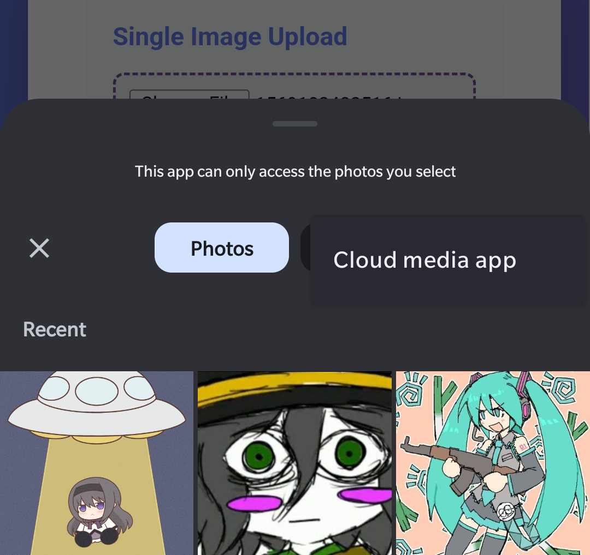
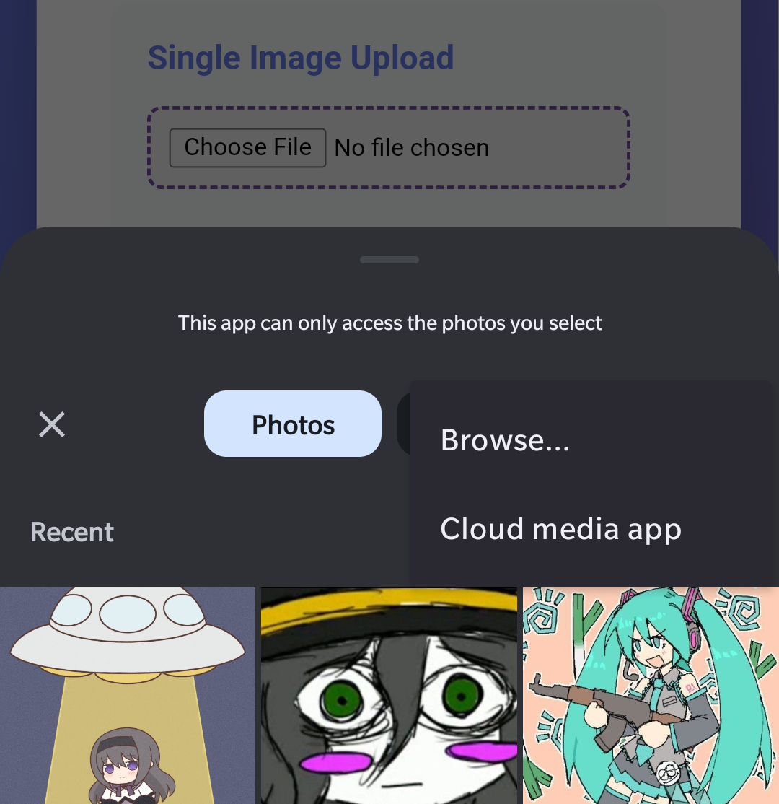

# NoPhotoPickerAPI

This is an Xposed module. The function of this module is to "bypass" the
limitations of the new
[Photo picker API](https://developer.android.com/training/data-storage/shared/photo-picker)
and allow users to the classic document/file picker.

> [!IMPORTANT]
> Tested on a limited number of devices. Your experience may vary, and bugs are possible.

## Screenshots

View Screenshots

### Without the module

### With the module

## Supported OSes

- Android 11-15 (Custom ROMs are **not** supported)

## Usage

1. Enable the module
2. Select:
   - System Framework **(recommended)**
   - Or specific apps (per-app)
3. Reboot (only if System Framework was selected)

## Important notes

- This module bypasses Android's Photo Picker privacy model.
- Apps may gain broader access to media files than intended by the system.
- Use at your own risk.

